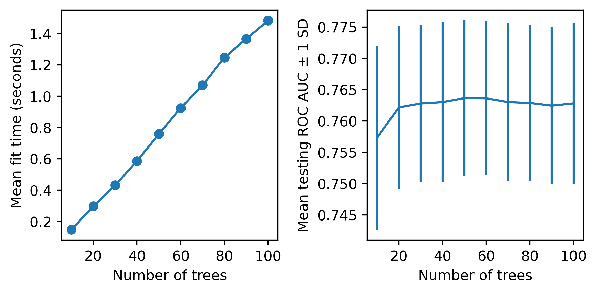
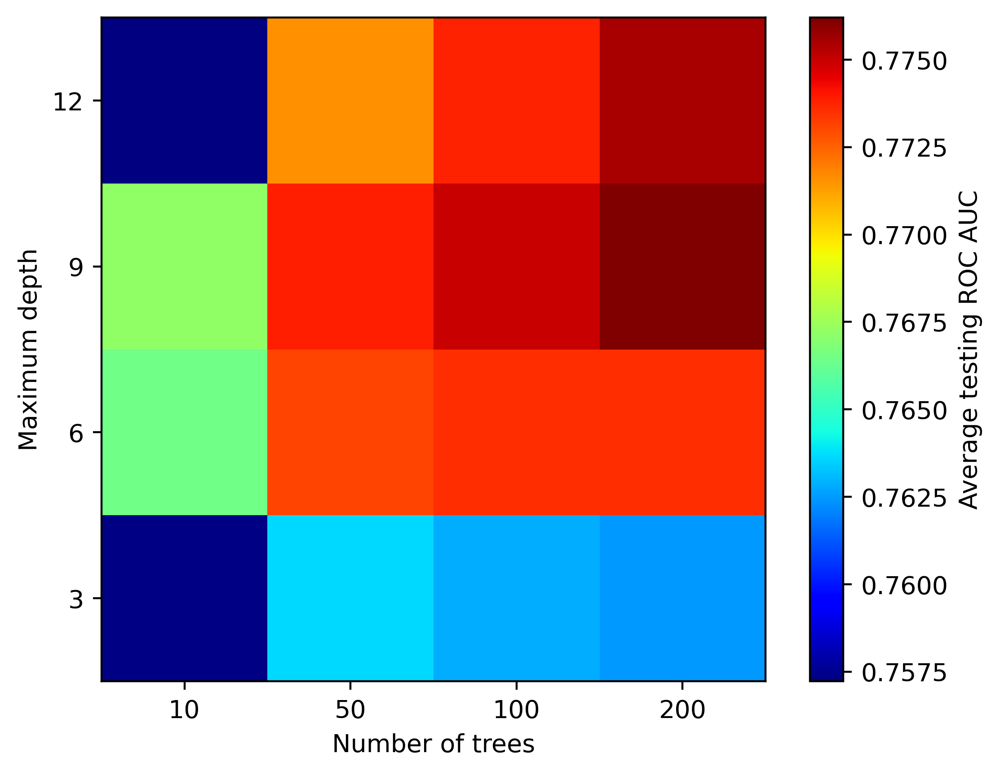

# Projeto 5 — Árvores de Decisão e Random Forest

Modelos baseados em árvores: visualização de árvores de decisão com Graphviz, ensemble Random Forest com busca de hiperparâmetros via `GridSearchCV` e análise de importância das variáveis.

**Fonte do projeto:** livro *Projetos de Ciência de Dados com Python* — Stephen Klosterman (Novatec Editora, 2020), Lição 5.

## Metodologia

1. **Dados:** UCI Credit Card (5.333 registros, 23 variáveis), split de treino/teste.
2. **Árvores de decisão:**
   - Árvore com 1 split (1 nó raiz) e com 3 splits, visualizadas com **Graphviz**;
   - Comparação visual da complexidade das árvores.
3. **Random Forest:**
   - `GridSearchCV` sobre `max_depth` e `n_estimators`;
   - Melhor combinação: **`max_depth = 9`, `n_estimators = 200`**.
4. **Avaliação:** AUC médio em validação cruzada; importância das variáveis (`feature_importances_`).

## Resultados

- **AUC médio = 0.776** (Random Forest otimizado) — melhor resultado da série de projetos.
- Importância das variáveis: **`PAY_1` domina com 0.44** — o valor do pagamento do mês anterior é o preditor mais forte.





## Estrutura do repositório

| Caminho | Conteúdo |
|---|---|
| `arvores_random_forest.ipynb` | Notebook completo, já executado |
| `Data/` | Datasets do projeto (UCI Credit Card) |
| `img/` | Figuras extraídas do notebook |

## Como executar

```bash
pip install pandas numpy matplotlib seaborn scikit-learn graphviz xlrd
jupyter notebook arvores_random_forest.ipynb
```

> Para as visualizações de árvores é necessário o binário do **Graphviz** (`dot`) instalado no sistema.

## Dependências

`pandas 1.5.3`, `numpy 1.24.4`, `scikit-learn 1.3.2`, `matplotlib 3.7.5`, `seaborn 0.13.2`, `graphviz`
